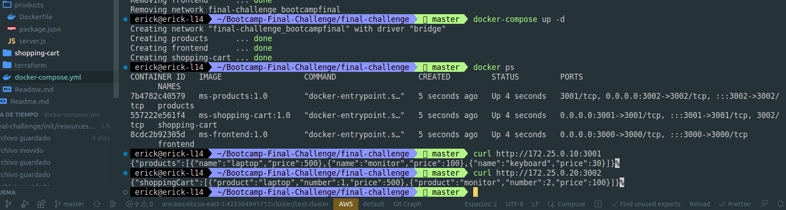

## Repo:

https://github.com/roxsross/devops-practice-tools/tree/master/final-bootcampdevops-ninja

## Comentarios:

1. Desplegar 3 servers en la misma VPC o VPC diferentes
2. Utilizar userdata para subir el docker y el dockerhub en cada server
3. Separar por ramas (develop, Testing, Master) 
4. utiizar el pipeline multibranch para setear por cada ambiente una rama.
5. Cada tfvars lo nombramos con la rama y concatenamos una variable local que permita concatenar el nombre. terraform.wordkspaces
## Ejecución por Fases:

   1. ##### Fase 1 - Hacer funcionar la app en docker localmente con SIN docker-compose
      
      - Build docker apuntando al folder 
  
      ``` 
         docker build -t ms-frontend:1.0 frontend
         docker build -t ms-products:1.0 products
         docker build -t ms-shopping-cart:1.0 shopping-cart
      ```
      - Push image into dockerHub 

         Se creó un script que ejecutara el push de cada imagen, el contenido es el siguiente:
  
      ``` 
         #!/bin/bash

         echo -e '\n\nPush de la imágen a dockerhub\n\n'

         docker login
         docker tag ms-frontend:1.0 191006/ms-frontend:1.0
         docker tag ms-products:1.0 191006/ms-products:1.0
         docker tag ms-shopping-cart:1.0 191006/ms-shopping-cart:1.0
         docker push 191006/ms-frontend:1.0
         docker push 191006/ms-products:1.0
         docker push 191006/ms-shopping-cart:1.0

         echo -e '\n\n FIN EJECUCIÓN PUSH DOCKERHUB\n\n'

      ```
   
      - Se ajustan los docker file de daca app para añadir otros componentes en la instalación que permitan ejecutar el tshoot. FInalmente, en las variables de ambiente para la ejecución se colocan las variables apuntando al localhost: 

      ```
         RUN apt update && apt install curl net-tools inetutils-ping -y

      ```
      - Iniciar los contenedores

      ```
      docker run -d -p 3000:3000 \
      -e PRODUCTS_SERVICE=localhost \
      -e SHOPPING_CART_SERVICE=localhost \
      ms-frontend:1.0

      docker run -d -p 3001:3001 ms-products:1.0
      docker run -d -p 3002:3002 ms-shopping-cart:1.0
      ```
   2. ##### Fase 2 - Hacer funcionar la app en docker localmente con CON docker-compose
      
      - Ajustar el docker-compose para hacer funcionar la apicación.
         
        - 1.a. Debemos crear una red interna que permita asociar los nombres localmente a un hostname local. Para ello se coloca esta porción de código con una nueva red.
      ```
         networks:
            bootcampfinal:
               driver: bridge
               ipam:
               config:
                  - subnet: 172.25.0.0/16
                     gateway: 172.25.0.1
      ```
        - Luego en cada contenedor se coloca la ip que va a utilizar cada Contenedor y al caller (frontend) Se le coloca un "extra_host" para definir dentro /etc/hosts los nombres de dominio locales para dicho contenedor

      ```
               version: '3'
         services:
            frontend:
               container_name: frontend
               ports:
                  - "3000:3000"
               image: ms-frontend:1.0
               #añade entradas al archivo /etc/hosts
               extra_hosts:
                  - "products:172.25.0.10"
                  - "shopping-cart:172.25.0.20"
               # Importante dejar las variables como valores y no como string de datos, es decir entre comillas, sino entrega error 'getaddrinfo ENOTFOUND "172.25.0.10"'
               environment:
                  - PRODUCTS_SERVICE=products
                  - SHOPPING_CART_SERVICE=shopping-cart
               networks:
                  bootcampfinal:
                  ipv4_address: 172.25.0.5

            shopping-cart:
               container_name: shopping-cart
               ports:
               - "3001:3001"
               image: ms-shopping-cart:1.0
               networks:
                  bootcampfinal:
                  ipv4_address: 172.25.0.20

            products:
               container_name: products
               ports:
               - "3002:3002"
               image: ms-products:1.0
               networks:
                  bootcampfinal:
                  ipv4_address: 172.25.0.10

         ```

        - Correr los contenedores localmente

         ```
         docker-compose up -d

         ```

        - dar de baja los contenedores localmente

         ```
         docker-compose down

         ```

        - Evidencias (Docker local/Docker Compose):

            


   3. ##### Fase 3 - Hacerlo funcionar con kubernetes utilizando minikube
      1. Creamos el template de kubernetes 

         ```
         kubectl apply -f file.yml

         ```

   4. ##### Fase 4 - Depslegar la infra con pipeline
         - Aprovisionar 3 servidores AWS EC2 con Terraform (server-dev, server-tst, server-prd)
         - Crear los ficheros de terraform + userdata (docker+docker-compose)
         - Crear Repositorio Github para la infra
         - Diagrama Arquitectura Infra 
   5. ##### Fase 5 - Desplegar la infra con los dockers y userdata usando terraform
   6. ##### Fase 6 -  En Kubernetes en killercoda desplegar los kubernetes. Puede que roxx nos disponibilice un EKS o podemos desplegarlo nosotros en la cuenta tlz 


### MEJORAS

1. Desplegar 1 vpc por cada ambiente."DONE"
2. Desplegar el terraform en github Actions.


# Evidencias de funcionamiento con despliegue y docker funcional:


#### TST
   - http://ec2-35-173-130-124.compute-1.amazonaws.com:3000/
  
      
      
#### DEV
   - http://ec2-54-166-135-90.compute-1.amazonaws.com:3000/

      
      
#### PRD
   - http://ec2-52-205-46-141.compute-1.amazonaws.com:3000/

      
      


